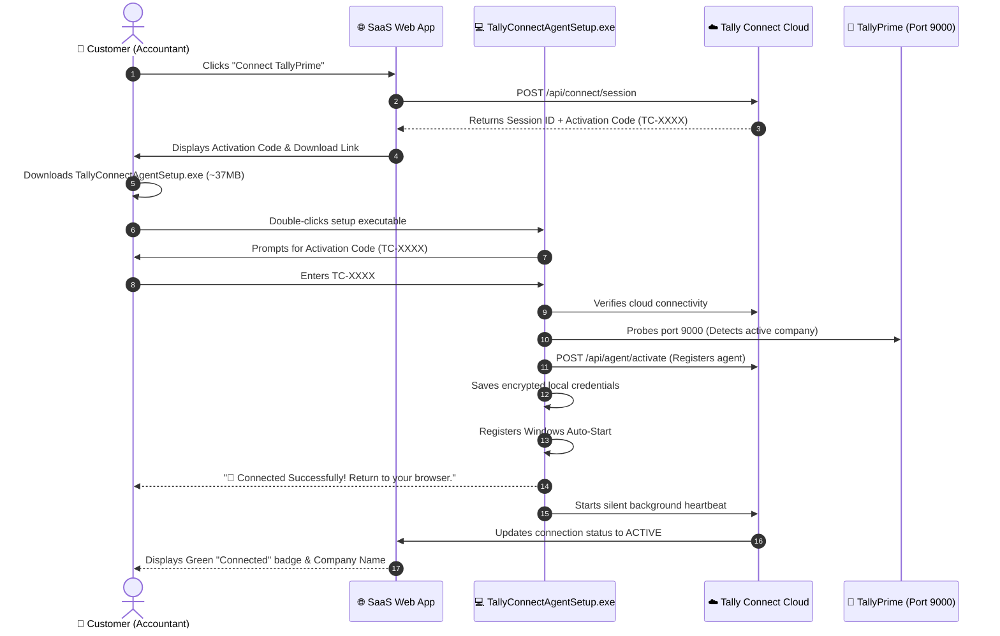

# Tally Connect — Customer Installation Flow & Experience Guide

**Document Version:** 1.0.0 (Phase 10.5 Production Validation)  
**Target Audience:** Non-technical Windows End-Users, SaaS Product Managers, Customer Support Engineers  
**Target Environment:** Windows 10, Windows 11, Windows Server 2016/2019/2022 (x64)

---

## 1. Executive Summary

Tally Connect eliminates all technical barriers for connecting desktop TallyPrime with modern cloud SaaS applications. 

A non-technical accountant or business owner can complete setup in **under 60 seconds** without:
- ❌ Pre-installing Node.js, Python, or Git
- ❌ Opening the Windows Command Prompt (cmd) or PowerShell
- ❌ Editing JSON or XML configuration files
- ❌ Configuring inbound firewall NAT rules or router port forwarding

---

## 2. Complete Customer Journey (Step-by-Step)



### Stage 1: In-App Connection Request (In Browser)
1. The user logs into their SaaS application (e.g. ERP, CRM, Invoicing Portal) and navigates to **Settings → Integrations → TallyPrime**.
2. The user clicks **"Connect Tally"**.
3. The SaaS platform immediately displays a 6-character activation code:
   ```
   Your Activation Code: TC-7290
   Expires in: 30 minutes
   ```
4. A direct download button is presented: **"Download Tally Connect for Windows"** (`TallyConnectAgentSetup.exe`).

### Stage 2: Download & Launch
1. The user downloads `TallyConnectAgentSetup.exe` directly into their `Downloads` or `Desktop` folder.
2. The executable is self-contained (~37MB) with an embedded runtime.
3. The user double-clicks `TallyConnectAgentSetup.exe`.
   - *Note on Windows SmartScreen:* If Windows Defender SmartScreen shows an alert ("Windows protected your PC"), the user clicks **"More info" → "Run anyway"**.

### Stage 3: Activation Code Entry
The user sees a clean, friendly setup assistant:
```text
===============================================================
📦 Tally Connect Setup
===============================================================
Welcome! This setup will link your TallyPrime in a few moments.

Enter the activation code shown on your screen (e.g. TC-4829): TC-7290
```

### Stage 4: Automated 5-Step Linking Wizard
The wizard executes 5 automated checks with clear status indicators:
```text
Activation Code: TC-7290

[1/5] Connecting to cloud service...
  ✔ Connected to cloud service

[2/5] Checking TallyPrime...
  ✔ TallyPrime detected
  ✔ Active Company: "Apex Industrial Technologies Pvt Ltd"

[3/5] Verifying activation code...
  ✔ Activation code verified
  ✔ Connected Company: "Apex Industrial Technologies Pvt Ltd"

[4/5] Saving secure settings...
  ✔ Settings saved securely

[5/5] Setting up automatic startup...
  ✔ Automatic startup enabled (starts with Windows)

===============================================================
🎉 Connected Successfully!
Tally Connect is now linked to your company.
Everything is set up and running quietly in the background.
You can now return to your browser.
===============================================================
```

### Stage 5: SaaS Confirmation
1. The customer switches back to their browser tab.
2. The SaaS platform automatically detects the activation via webhook / polling.
3. The screen refreshes to show:
   - **Status:** `ACTIVE` (Green Indicator)
   - **Connected Company:** `Apex Industrial Technologies Pvt Ltd`
   - **Tally Connection:** `Online`
   - **Auto-Sync:** Enabled

---

## 3. Required Documentation Screenshots Matrix

For user guides, video walkthroughs, and in-app help centers, the following 7 screenshots must be captured:

| # | Screenshot ID | Screen / View | Key Visual Elements | Purpose |
|---|---------------|---------------|---------------------|---------|
| 1 | `ui-saas-modal-init` | SaaS Web App Modal | "Connect Tally" button, 6-character code (e.g. `TC-7290`), 30-min timer, Download button | Guides user on where to find their activation code |
| 2 | `ui-win-smartscreen` | Windows SmartScreen (if uncertified) | Blue modal, "More info" link highlighted, "Run anyway" button highlighted | Overcomes initial Windows security barrier |
| 3 | `ui-setup-wizard-prompt` | Console Setup Assistant | Clean welcome banner, code entry cursor | Reassures user they are in the right official app |
| 4 | `ui-setup-wizard-success` | Completed Wizard Screen | All 5 checkmarks green, Company Name identified, Celebration banner | Confirms installation success |
| 5 | `ui-setup-tally-offline` | Tally Offline Notice Screen | Friendly notice ("TallyPrime is not open right now. Setup will finish normally") | Shows user that offline Tally is not a fatal crash |
| 6 | `ui-saas-connected-badge` | SaaS App Integration Page | Green `ACTIVE` status badge, company name, sync history | Confirms end-to-end cloud handshake |
| 7 | `ui-task-manager-process` | Windows Task Manager (Details) | `TallyConnectAgent.exe` running under background processes (~45MB RAM) | Shows IT admins the silent background footprint |

---

## 4. Customer Error States & Friendly Resolutions

Tally Connect replaces all raw error codes and network stacks with actionable, non-technical instructions:

### Error 1: Invalid Activation Code
- **Technical Cause:** Mistyped code or non-existent code in SaaS database.
- **Customer Screen:**
  ```text
  ✖ Setup could not be completed: The activation code could not be verified. Please check the code and try again.
  ```
- **Action for Customer:** Verify the 6-character code displayed in the browser and re-enter.

### Error 2: Expired Activation Code
- **Technical Cause:** Code created more than 30 minutes ago.
- **Customer Screen:**
  ```text
  ✖ Setup could not be completed: This activation code has expired. Please generate a new code from your dashboard.
  ```
- **Action for Customer:** Return to SaaS browser window, click "Generate New Code", and re-enter.

### Error 3: No Internet Connection
- **Technical Cause:** Local network drop or DNS resolution failure.
- **Customer Screen:**
  ```text
  ✖ Setup could not be completed: Unable to connect to the cloud service. Please check your internet connection and try again.
  ```
- **Action for Customer:** Check Wi-Fi / Ethernet connection and retry setup.

### Error 4: TallyPrime Not Open During Setup
- **Technical Cause:** TallyPrime is closed or not running on port 9000.
- **Customer Screen:**
  ```text
  [2/5] Checking TallyPrime...
    ℹ Note: TallyPrime is not open right now.
      Setup will finish normally, and Tally Connect will link automatically when TallyPrime is opened.
  ```
- **Action for Customer:** No action required! Setup finishes successfully. As soon as the accountant opens TallyPrime, the agent detects it within 30 seconds and begins data synchronization.

### Error 5: Tally Server / ODBC Port Disabled
- **Technical Cause:** TallyPrime is open, but HTTP XML Server is disabled in Tally settings.
- **Action for Customer:**
  1. In TallyPrime, press **F1: Help** → **Settings** → **Connectivity**.
  2. Ensure **Client/Server Configuration** is set to **Both** or **Server**.
  3. Ensure **Port** is set to **9000**.
  4. Restart TallyPrime.

---

## 5. Customer Support Runbook & Checklist

Use this checklist when assisting a customer who reports connection issues:

### Tier-1 Support Quick Checklist
1. **Is TallyPrime Running?**
   - Ask customer: *"Is TallyPrime currently open on your computer with a company selected?"*
   - If not, instruct them to open TallyPrime and load their company.
2. **Is TallyPrime's Port 9000 Active?**
   - Open any browser on the customer's PC and go to: `http://localhost:9000`
   - If Tally is responding, the browser will display an XML status or prompt.
   - If `This site can't be reached` appears: Guide the customer to enable Connectivity in TallyPrime (**F1 → Settings → Connectivity → Port 9000**).
3. **Is the Background Agent Running?**
   - Open **Windows Task Manager** (`Ctrl + Shift + Esc`).
   - Look for **TallyConnectAgent** under Background Processes.
4. **Quick Diagnostic Command:**
   - Open PowerShell or Command Prompt in the installation folder and run:
     ```cmd
     TallyConnectAgent.exe --status
     ```
   - Customer-friendly output displayed:
     ```text
     --- Tally Connect Status ---
     Company:       Apex Industrial Technologies Pvt Ltd
     Status:        ACTIVE
     TallyPrime:    Connected
     Open Company:  Apex Industrial Technologies Pvt Ltd
     Cloud Service: Connected
     Auto-Start:    Enabled
     ```
5. **Checking Local Logs:**
   - Log files are located securely at:
     ```text
     %APPDATA%\TallyConnect\logs\agent.log
     %APPDATA%\TallyConnect\logs\errors.log
     ```
   - These files contain diagnostic timestamps, latency metrics, and API request IDs without storing plain-text financial ledgers.

---

## 6. Security & Data Protection Guarantees

When customer IT or security teams evaluate Tally Connect:

| Guarantee | Description |
|-----------|-------------|
| **Outbound Only** | Tally Connect only makes outbound HTTPS requests on port 443. It requires **zero inbound open ports** or port-forwarding on the customer's firewall. |
| **Strict Permission Scoping** | Only entity types explicitly approved by the customer (e.g. Customers, Invoices) are extracted. Disallowed entities (e.g. Bank Ledgers, Payroll) are blocked at the desktop agent level. |
| **Encrypted Transit & Storage** | All payloads are encrypted in transit via TLS 1.3 and hashed/salted with SHA-256 tokens. |
| **No Third-Party Runtime** | Standalone binary compiled directly with no dependency on Node.js, Python, or shell script interpreters. |
